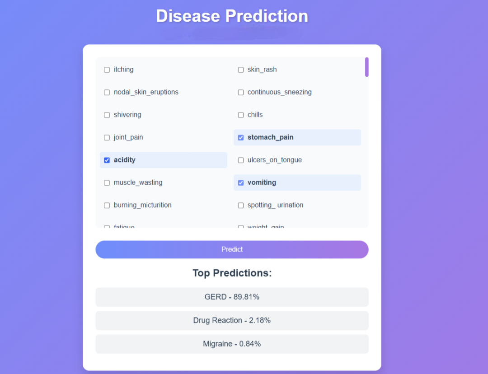

# HealthPredictorXGB


## 🩺 Disease Prediction Using Symptoms

**HealthPredictorXGB** is a machine learning-based web application that predicts potential diseases based on user-provided symptoms. It uses the **XGBoost** algorithm, known for its robustness and accuracy in classification tasks.

---

### 🚀 Features

- Predicts diseases based on input symptoms.
- Trained using the XGBoost algorithm for high accuracy.
- Includes pre-processed datasets for training and testing.
- Optional Flask web application for a simple user interface.

---

### 📦 Requirements

To run the code, ensure the following Python libraries are installed:

- `pandas`
- `numpy`
- `xgboost`
- `scikit-learn`
- `flask` (only if using the web app)

Install all dependencies using:

```bash
pip install -r requirements.txt
